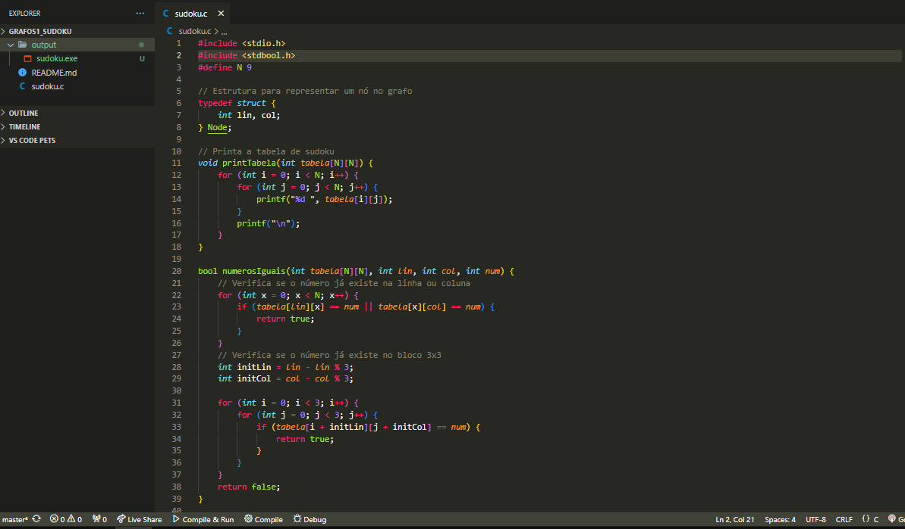
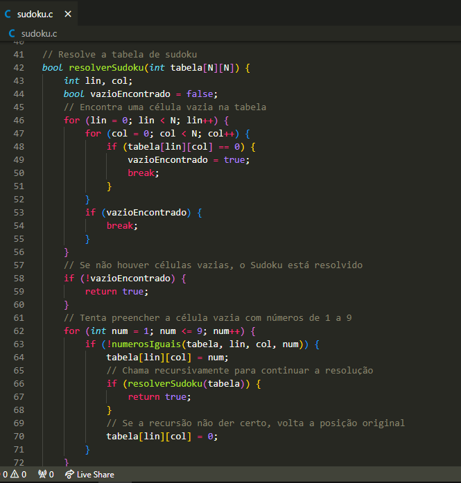
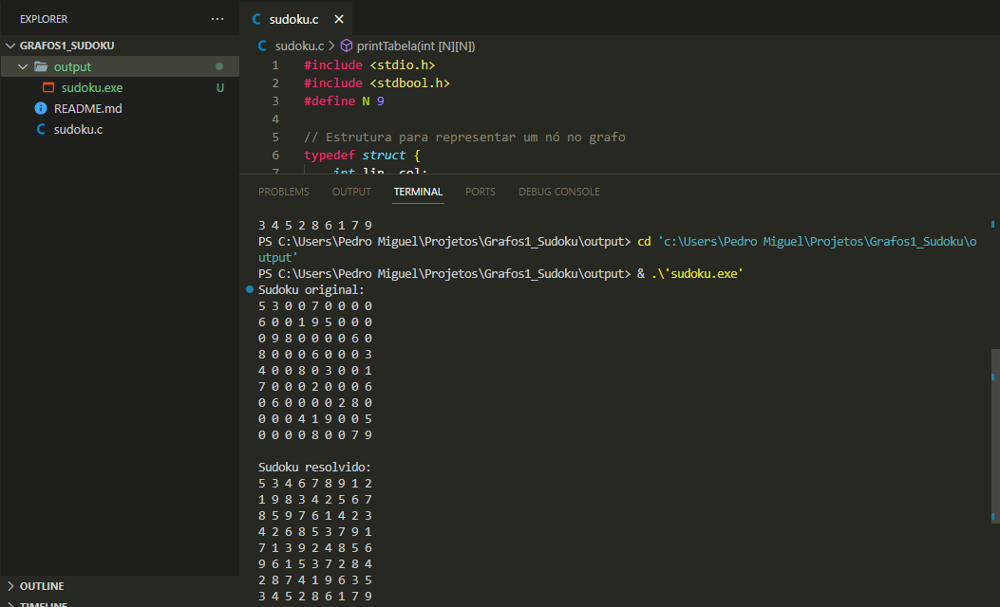

# Sudoku em BFS

**Número da Lista**: Grafos 1 
**Conteúdo da Disciplina**: Grafos 

## Alunos
|Matrícula | Aluno |
| -- | -- |
| 19/0097043  |  Yves Gustavo Pimenta |
| 20/0059980  |  Pedro Miguel Martins de Oliveira dos Santos |

## Sobre 
Descreva os objetivos do seu projeto e como ele funciona. 

## Screenshots

Podemos ver aqui as variaveis de iniciação do código e a função de números iguais que compara um número com seus correspondentes na mesma linha, coluna e quadro 3x3

Já aqui encontramos a função que rege a solução do sudoku por meio de uma BFS

Esse é o resultado em exibição: 

## Instalação 
**Linguagem**: C 

Para utilizar o programa é necessário ter a linguagem C
instalada no computador juntamente com um compilador.

## Uso 
Para executar o código basta tê-lo em sua máquina e realizar a compilação, após isso o resultado irá aparecer em seu terminal
